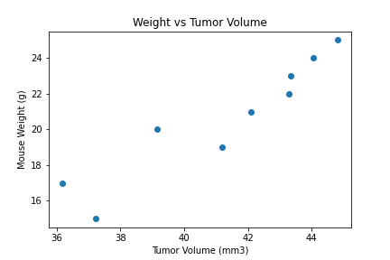

# matplotlib-challenge

This contains a script to analyze pharmaceutical data about mice and tumor volumes. The goal is analyze the mice as well as the drug regimens used in the study. The main drug analysis is done on Capumulin.

## Resources

Within the resources file, contains the csv files needed to perform the analysis.

### CSVs

* Mouse_metadata.csv
* Study_results.csv

### Software used

* Python: 3.7.4
* matplotlib: 3.2.2
* pandas: 1.0.5
* scipy: 1.5.0
* numpy: 1.17.0
* Jupyter notebooks to display our code

## Test

File used to hold pseudocode and any extra work.

## Submission

Within the submission file contains the script that will run the analysis. Along with the code will contain images of the charts individually.

Within the script will contain extra insight that would assist in explaining certain irregularities within the charts.

Analysis that has been done include:

* Statistics Table (mean, median, variance(var), standard deviation(std), sem)
* Bar plot of the total number of data points for each drug regimen
* Pie Chart that compares the parity of the mices' sex.
* The median of selected drug regimens and quantitatively determines what values are outliers, using quartiles
* A box and whiskers plot to graphically show outliers
* A line plot for one mouse being given Capumulin
* Weight vs Average Tumor Size scatterplot
* A linear regression line using the above scatterplot and determining the correlation coefficient.

Below are the charts that have been created using both matplotlib packages and pandas.plot:

Bar plot of the total data points for each drug regimen

Pie plot of the total mice for each sex

Box and whisker plot of four chosen drug regimens

Tumor Volume vs Time line graph of a single mouse using Capomulin. (Mouse S185)

Scatter plot of weight versus tumor volume.

The regression line of the scatter plot above.

## Data Observation

* There is a strong positive correlation between weight and tumor volume. An observation that can be made is that the larger the tumor the heavier the mouse is. This can be observed with the regression line in the last chart.

* The outlier found in the box and whiskers plot is not quantitatively an outlier. Calculating the quartiles and both the upper bound and lower bound. It is found that the lower bound of the Infubinol drug is 33.282. The outlier is greater than the lower bound. However, the infubinol data is tightly clustered. The outlier is outside of the cluster, making it an outlier.

* Based on the chosen mouse. Capomulin is an effective drug in decreasing the tumor volume in mice. If the other mice follow the same trend, then Capomulin is a sucess in combatting SCC tumor growths.
